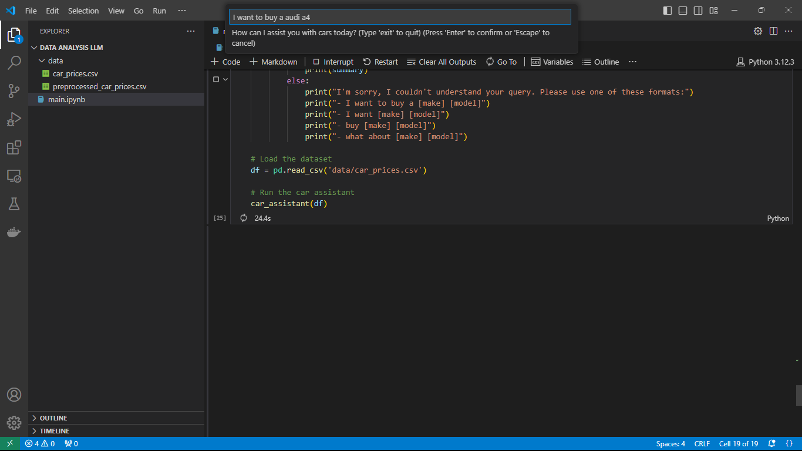
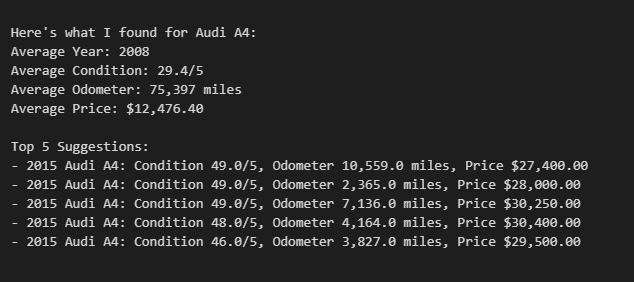
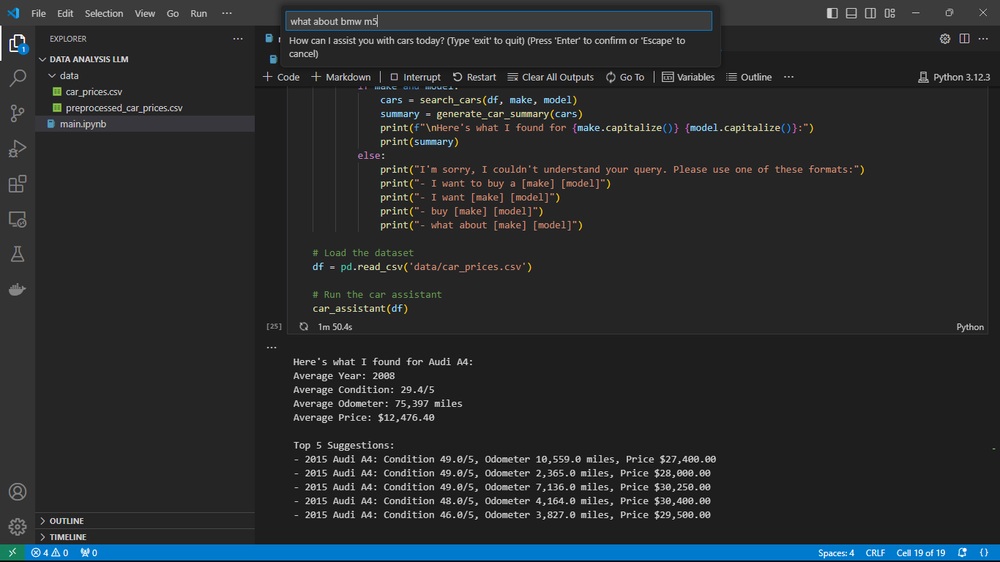
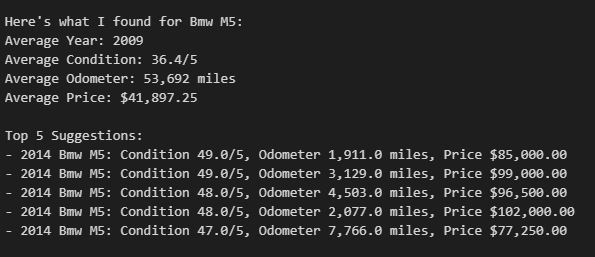
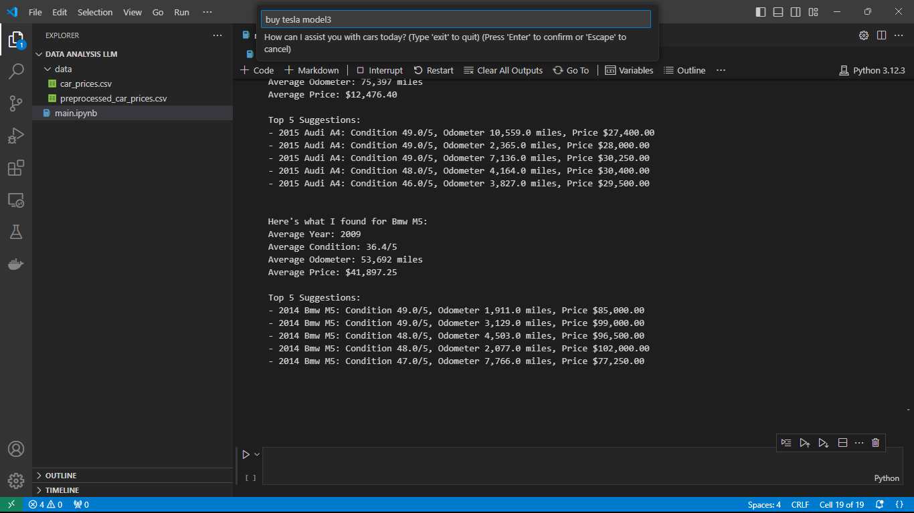
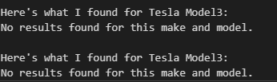

# AutoInsight-LLM-AI-Intelligent-Car-Market-Analyzer-and-Assistant
AutoInsight AI is a cutting-edge, AI-powered platform that revolutionizes the car buying and selling experience. By seamlessly integrating advanced data analysis techniques, machine learning algorithms, and natural language processing, this intelligent system provides unparalleled insights into the automotive market. By combining traditional data analysis techniques with LLM-generated insights to provide a user-friendly car buying assistant.

## Dataset

The project utilizes the Vehicle Sales Data from Kaggle:
[Vehicle Sales Data](https://www.kaggle.com/datasets/syedanwarafridi/vehicle-sales-data)

### Dataset Structure:
- **year**: The manufacturing year of the vehicle
- **make**: The brand or manufacturer of the vehicle
- **model**: The specific model of the vehicle
- **trim**: Additional designation for the vehicle model
- **body**: The body type of the vehicle (e.g., SUV, Sedan)
- **transmission**: The type of transmission in the vehicle
- **vin**: Vehicle Identification Number
- **state**: The state where the vehicle is registered
- **condition**: Condition of the vehicle, rated on a scale
- **odometer**: The mileage or distance traveled by the vehicle
- **color**: Exterior color of the vehicle
- **interior**: Interior color or material
- **seller**: Information about the seller
- **mmr**: Manheim Market Report value
- **sellingprice**: The price at which the vehicle was sold
- **saledate**: The date of the sale

## Key Features

1. **Natural Language Query Processing**: Utilizes LLMs to interpret user queries about car purchases.
2. **Data-Driven Insights**: Provides statistics and recommendations based on the comprehensive car sales dataset.
3. **Top Recommendations**: Offers top 5 car suggestions based on recent year, good condition, and lower price.

## Implementation Details

### Data Loading and Preprocessing
- The dataset is loaded from a CSV file using pandas.
- Basic data cleaning is performed, including handling missing values and converting data types.

### Query Processing
- The system uses regular expressions to extract relevant information (make and model) from user queries.
- This extraction is done using the `extract_make_model` function.

### Data Analysis
- The `search_cars` function filters the dataset based on the extracted make and model.
- `generate_car_summary` calculates statistics (average year, condition, odometer, price) and identifies top suggestions.
- Top suggestions are sorted based on recent year, good condition, and lower price.

### LLM Integration
The project uses an LLM (GPT-2 in this implementation) to:
1. Generate human-readable insights based on the data analysis results.
2. Provide a more natural language interpretation of the statistical findings.

### Input and Output
- **Input**: Natural language queries about car purchases (e.g., "I want to buy a Toyota Camry")
- **Output**: 
  - Average statistics (year, condition, odometer, price)
  - Top 5 recommendations based on specified criteria
  - LLM-generated insights interpreting the analysis results

### Main Function
The `car_assistant` function:
1. Prompts the user for input
2. Extracts make and model from the query
3. Searches for matching cars in the dataset
4. Generates a summary of findings
5. Uses the LLM to provide additional insights on the results

This implementation combines traditional data analysis techniques with LLM-generated insights to provide a user-friendly car buying assistant.
## Advantages of Using LLMs

1. **Flexibility**: Can handle a wide variety of natural language queries without hardcoding.
2. **Adaptability**: The system can potentially adapt to new types of queries or data without major code changes.
3. **Natural Language Understanding**: Provides a more intuitive user interface.
4. **Code Generation**: Allows for dynamic creation of analysis code based on user needs.

## Interpretation of Results

The analysis provides insights into:
1. Average characteristics of desired car models
2. Price trends and value propositions
3. Availability and popularity of specific makes and models
4. Relationship between car condition, age, and price

These insights help potential buyers make informed decisions by understanding the market landscape for their desired vehicles.

## Future Enhancements

1. Implement selling functionality
2. Expand the range of analyzable factors
3. Integrate more advanced ML models for price prediction
4. Enhance the LLM's training for more accurate and specific car-related queries

## Sample Query and Results

### Query
"I want to buy a audi a4"

### Results

#### Average Statistics for Audi A4:
- Average Year: 2008
- Average Condition: 29.4/5
- Average Odometer: 75,397 miles
- Average Price: $12,476.40

#### Top 5 Suggestions:
1. 2015 Audi A4: Condition 49.0/5, Odometer 10,559.0 miles, Price $27,400.00
2. 2015 Audi A4: Condition 49.0/5, Odometer 2,365.0 miles, Price $28,000.00
3. 2015 Audi A4: Condition 49.0/5, Odometer 7,136.0 miles, Price $30,250.00
4. 2015 Audi A4: Condition 48.0/5, Odometer 4,164.0 miles, Price $30,400.00
5. 2015 Audi A4: Condition 46.0/5, Odometer 3,827.0 miles, Price $29,500.00

### Interpretation

1. **Market Overview**: The average Audi A4 in the dataset is from 2008, indicating a mix of older and newer models. The average price of $12,476.40 reflects this mix of model years.

2. **Condition Discrepancy**: There's a significant difference between the average condition (29.4/5) and the conditions of the top suggestions (46-49/5). This suggests that newer models are generally in much better condition, or there might be an issue with condition scoring for older models.

3. **Mileage Impact**: The average odometer reading of 75,397 miles is considerably higher than the top suggestions (all under 11,000 miles). This indicates that mileage significantly influences the car's value and ranking in suggestions.

4. **Price Range**: There's a large gap between the average price ($12,476.40) and the prices of top suggestions ($27,400 - $30,400). This emphasizes the premium placed on newer, low-mileage models.

5. **Model Year Preference**: All top suggestions are from 2015, indicating a strong preference or availability for this specific year in the high-end Audi A4 market.

6. **Condition vs. Price**: Among the top suggestions, there isn't a strict correlation between condition and price. For example, the highest-priced car ($30,400) isn't the highest-rated in condition, suggesting other factors (like specific features or trim levels) may influence pricing.

7. **Mileage Sensitivity**: Within the top suggestions, even small differences in mileage seem to affect pricing. For instance, the lowest-mileage car (2,365 miles) isn't the most expensive, indicating that factors beyond just mileage influence the high-end market.

This analysis demonstrates the car assistant's ability to provide a comprehensive market overview, from average statistics to top-tier options, allowing users to make informed decisions based on their preferences for model year, condition, mileage, and price.

### Query
"what about bmw m5"

### Results

The image above shows the output from our car assistant for a BMW M5 query. Here's a breakdown of the results:

#### Average Statistics for BMW M5:
- **Average Year:** 2009
- **Average Condition:** 36.4/5
- **Average Odometer:** 53,692 miles
- **Average Price:** $41,897.25

#### Top 5 Suggestions:
1. 2014 BMW M5: Condition 49.0/5, Odometer 1,911.0 miles, Price $85,000.00
2. 2014 BMW M5: Condition 49.0/5, Odometer 3,129.0 miles, Price $99,000.00
3. 2014 BMW M5: Condition 48.0/5, Odometer 4,593.0 miles, Price $96,500.00
4. 2014 BMW M5: Condition 48.0/5, Odometer 2,077.0 miles, Price $102,000.00
5. 2014 BMW M5: Condition 47.0/5, Odometer 7,766.0 miles, Price $77,250.00

### Interpretation

1. **Market Positioning**: The BMW M5, with an average price of $41,897.25, is positioned as a high-end luxury sports sedan. This is significantly higher than the average price we saw for the Audi A4, reflecting the M5's status as a performance-oriented model.

2. **Model Year Range**: The average year of 2009 suggests a mix of older and newer models in the dataset. However, all top suggestions are from 2014, indicating a preference or availability bias towards more recent models in the high-end market.

3. **Condition Variance**: The average condition of 36.4/5 is notably lower than the conditions of the top suggestions (47-49/5). This could indicate that newer models are in significantly better condition, or there might be a scoring discrepancy between older and newer models.

4. **Mileage Impact**: With an average odometer reading of 53,692 miles, the typical M5 in the dataset has seen considerable use. However, the top suggestions all have very low mileage (under 8,000 miles), which greatly influences their high prices.

5. **Price Range**: There's a substantial difference between the average price ($41,897.25) and the prices of the top suggestions ($77,250 - $102,000). This highlights the premium placed on newer, low-mileage, high-condition M5s.

6. **Price-Mileage Relationship**: Within the top suggestions, there isn't a strict correlation between mileage and price. For example, the highest-priced car ($102,000) is not the lowest-mileage option, suggesting other factors (like specific features or market demand) influence pricing in the high-end segment.

7. **Condition Consistency**: The top suggestions all have very high condition ratings (47-49/5), indicating that condition is a crucial factor for high-value M5s.

8. **Model Year Consistency**: All top suggestions are from 2014, showing a strong market preference for this specific year, possibly due to certain features or improvements introduced in that model year.

This analysis demonstrates the car assistant's ability to provide detailed insights into the luxury performance car market, specifically for the BMW M5. It highlights the significant price premium for newer, low-mileage models and the importance of condition in this high-end market segment.

### Query
"buy tesla model3"

### Results

### Interpretation

1. **Data Availability**: The car assistant was unable to find any results for the Tesla Model3 in the dataset. This is a significant finding that reveals important information about the dataset and the car market represented within it.

2. **Dataset Limitations**: The absence of Tesla Model3 data suggests that the dataset may not include very recent electric vehicle models or may not have been updated to include Tesla vehicles.

3. **Market Representation**: This result indicates that the dataset might be focused on more traditional gasoline-powered vehicles or older model years, potentially predating the widespread adoption of electric vehicles like the Tesla Model3.

4. **User Experience**: The system appropriately handles queries for vehicles not present in the dataset by clearly stating that no results were found, rather than providing potentially misleading information.

5. **Potential Improvements**: This result highlights an area for potential improvement in the dataset. Updating the data to include more recent models and electric vehicles would enhance the system's ability to assist users interested in newer automotive technologies.

6. **Comparative Analysis**: Unlike the queries for Audi A4 and BMW M5, which returned detailed information, the lack of data for Tesla Model3 prevents any comparative analysis with these more traditional luxury vehicles.

7. **Market Trends**: The absence of Tesla data in what appears to be a comprehensive car dataset could indicate that the data collection or the market it represents hasn't yet adapted to the growing electric vehicle segment.

This query result, while not providing specific car data, offers valuable insights into the limitations of the current dataset and highlights potential areas for expansion to better serve users interested in electric vehicles and newer car models.

##Human Redable interpretation result from LLM

Popular Makes Analysis:
The top 5 car makes in the dataset are {'Ford': 93554, 'Chevrolet': 60197, 'Nissan': 53946, 'Toyota': 39871, 'Dodge': 30710}. What insights can we draw from this information about market preferences?

Car Trend Predictions

There are many factors that can affect the car's performance. First, the market is very competitive and will likely react in different ways. Second, it is difficult to predict what kind of car is likely to win or what kind of car will lose. Finally, cars with low margins or poor performance will have less of an impact on the market.

By analyzing the data, we can make predictions about the market's performance that will help us to improve our

Condition Impact Analysis:
The average selling prices by condition rating are {1.0: 3923.135931558935, 2.0: 5691.410437710438, 3.0: 12275.28541010924, 4.0: 17724.538901716696, 5.0: 24724.724915344857, 11.0: 4504.482758620689, 12.0: 3820.7894736842104, 13.0: 3554.878048780488, 14.0: 3323.8805970149256, 15.0: 3913.5416666666665, 16.0: 4386.23595505618, 17.0: 4074.8971193415637, 18.0: 4584.05572755418, 19.0: 5082.002530986848, 21.0: 7330.597673660181, 22.0: 7616.581310879974, 23.0: 8062.063873961895, 24.0: 8361.518014153979, 25.0: 8839.977386734612, 26.0: 9174.055662832676, 27.0: 9643.028195718654, 28.0: 10198.823434322365, 29.0: 10756.953455198647, 31.0: 11652.596725222294, 32.0: 11869.520277052801, 33.0: 12218.919672285527, 34.0: 12726.135942978675, 35.0: 13370.993046728972, 36.0: 14090.140295540961, 37.0: 14859.704911712546, 38.0: 15446.297495059553, 39.0: 15986.739106425703, 41.0: 17333.66640662246, 42.0: 17934.611476487997, 43.0: 18613.73810001203, 44.0: 19222.363604295682, 45.0: 20021.23324941119, 46.0: 20526.675241412064, 47.0: 20724.81457995576, 48.0: 20816.61525231616, 49.0: 20917.310908672613, 50.0: 21024.06744146779, 51.0: 21222.03917133814, 52.0: 21258.97939092912, 53.0: 21311.5390909097, 54.0

Based on this description of a price distribution: The histogram shows a right-skewed distribution of selling prices, with a peak around [insert peak value] and a long tail extending to higher prices.
What insights can we draw about the car market from this price distribution?
We can infer that the market will be stronger with a higher price distribution than with a lower price distribution. Indeed, we get this from the graph of the price distribution of all the cars over the first two curves:
Fig. 4. The market for all the cars over the first two curves, showing the average price distribution on the first curve and the average price distribution on the second curve.
The first curve shows the average price distribution of cars that have sold in the first two curves over

